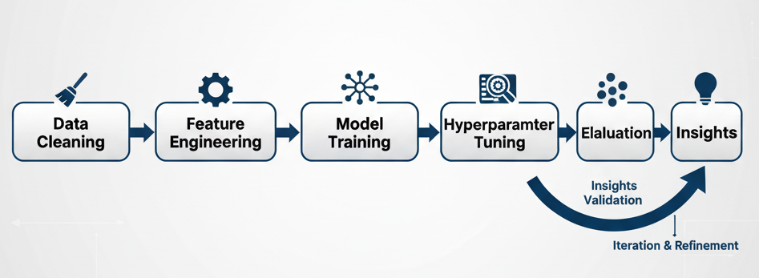
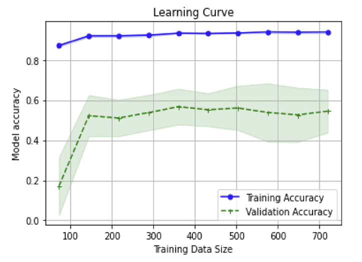
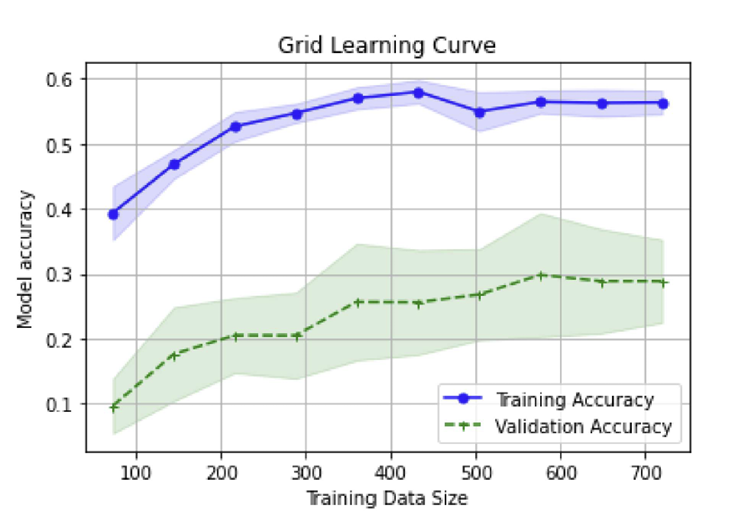
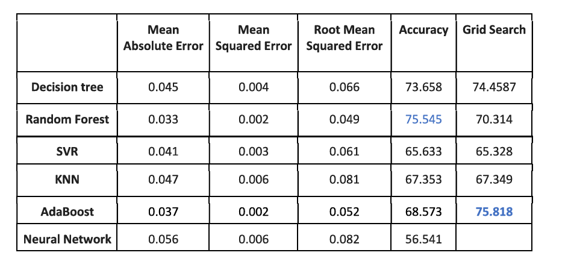
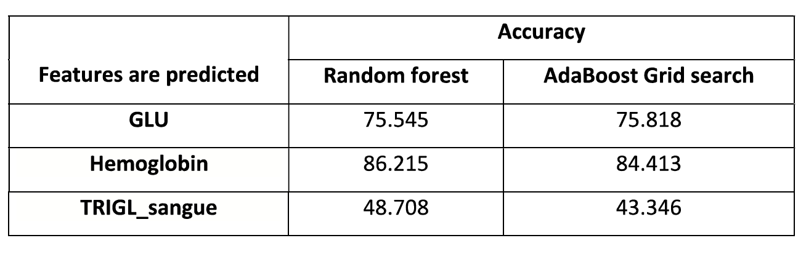
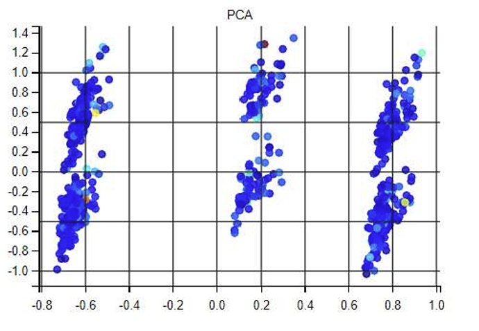
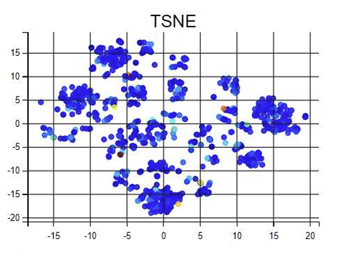
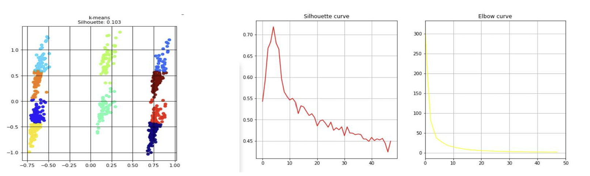
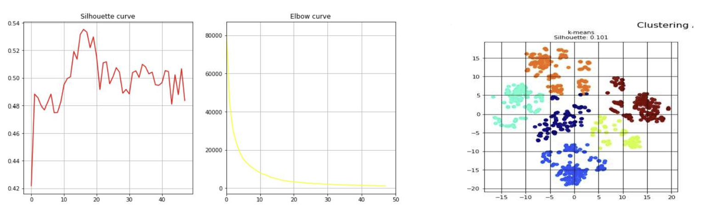
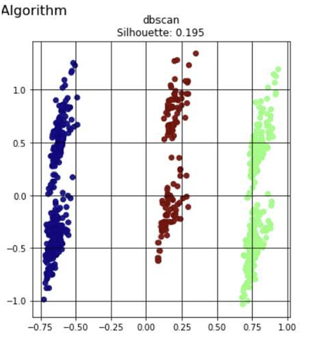

# Healthcare Predictive Analytics: Comparative Study of Machine Learning Algorithms

> **Figure:** End-to-end workflow showing data cleaning, feature engineering, model training, hyperparameter tuning, and insights validation.

---

## Project Overview
This project focuses on applying and comparing multiple **machine learning algorithms** on a healthcare dataset to predict patient health indicators such as **Hemoglobin**, **Glucose (GLU)**, and **Triglycerides**.  
The study includes **supervised**, **unsupervised**, and **dimensionality reduction** techniques to analyze model accuracy and pattern discovery in health data.

> ⚠️ *Note:* Due to confidentiality, healthcare data and code are not included.  
> This repository documents the **methodology, workflow, analysis, and insights** to showcase machine learning and analytical expertise.

---

## Objectives
- Predict healthcare-related outcomes using regression models.  
- Compare performance across multiple algorithms.  
- Apply unsupervised clustering to discover patient groupings.  
- Visualize data patterns using dimensionality reduction methods.

---

## Dataset Summary
- **Domain:** Healthcare  
- **Instances:** 1930  
- **Features:** 44 (including Gender, Age, BP, Glucose, etc.)  
- **Target Variables:** Hemoglobin, GLU, Triglycerides  

### Data Preprocessing
- Missing values handled (NaN → 0 or mean replacement).  
- Unnecessary columns (e.g., Date of Birth) dropped.  
- Features scaled using **MinMaxScaler**.  
- Dataset split: **80% training / 20% testing**.

---

## Machine Learning Workflow
1. Data Cleaning & Feature Engineering  
2. Model Training (Supervised Algorithms)  
3. Hyperparameter Tuning (Grid Search)  
4. Evaluation (MAE, MSE, RMSE, MAPE, Accuracy)  
5. Dimensionality Reduction (PCA, t-SNE)  
6. Clustering (K-Means, DBSCAN)  
7. Insight Generation  

---

## Supervised Learning Models

| Category | Algorithms |
|-----------|-------------|
| Baseline | Dummy Regressor |
| Tree-Based | Decision Tree, Random Forest |
| Ensemble | AdaBoost |
| Kernel-Based | Support Vector Regressor (SVR) |
| Distance-Based | K-Nearest Neighbors (KNN) |
| Neural Network | Multilayer Perceptron (MLP) |

---

## Learning Curve Analysis

Grid Search optimization was applied to improve model generalization.  
Below are the **Random Forest learning curves** before and after tuning.

<table align="center">
<tr>
  <td align="center"><b>Random Forest Learning Curve</b></td>
  <td align="center"><b>Random Forest GRID Learning Curve</b></td>
</tr>
<tr>
  <td></td>
  <td></td>
</tr>
</table>

<i>Learning curves showing improved balance between training and validation accuracy after hyperparameter tuning.</i>

---

## Model Comparison

Performance metrics for each regression model are summarized below.

> **Figure:** Comparative analysis of regression models using MAE, MSE, RMSE, and Accuracy.  
> *Random Forest and AdaBoost achieved the best results.*

---

## 🧾 Feature-Wise Prediction Results

| Feature | Random Forest | AdaBoost (Grid Search) |
|----------|----------------|------------------------|
| GLU | 75.545 | 75.818 |
| Hemoglobin | 86.215 | 84.413 |
| TRIGL_sangue | 48.708 | 43.346 |

> **Figure:** Model accuracies for key predicted health indicators.

---

## 🔻 Dimensionality Reduction

To visualize the dataset in reduced form and identify feature relationships, **PCA** and **t-SNE** were applied.

<table align="center">
<tr>
  <td align="center"><b>PCA vs t-SNE</b></td>
  <td align="center"><b>tSNE</b></td>
</tr>
<tr>
  <td></td>
  <td></td>
</tr>
</table>

<i>PCA (left) shows linear separability, while t-SNE (right) reveals non-linear data structure.
</i>

 
---

## Unsupervised Learning and Clustering

Clustering helps group patients with similar characteristics.

### K-Means with PCA

> **Figure:** K-Means clustering after PCA achieved best silhouette score (0.718), showing well-separated clusters.

### K-Means with t-SNE

> **Figure:** K-Means with t-SNE visualization provided moderate separation (silhouette ≈ 0.53).

### DBSCAN Clustering

> **Figure:** DBSCAN clusters after PCA reduction — less dense clusters (silhouette ≈ 0.19).

---

## Key Results Summary

| Algorithm | MAE | MSE | RMSE | Accuracy (%) |
|------------|-----|-----|------|---------------|
| Decision Tree | 0.045 | 0.004 | 0.066 | 73.65 |
| Random Forest | 0.033 | 0.002 | 0.049 | **75.54** |
| SVR | 0.041 | 0.003 | 0.061 | 65.63 |
| KNN | 0.047 | 0.006 | 0.081 | 67.35 |
| AdaBoost | 0.037 | 0.002 | 0.052 | **75.81** |
| Neural Network | 0.056 | 0.006 | 0.082 | 56.54 |

**Top Performers:** Random Forest and AdaBoost (Grid Search)  
**Best Overall:** Random Forest with 86.21% Hemoglobin prediction accuracy

---

## Insights & Learnings
- Ensemble models performed best due to reduced overfitting and better bias-variance control.  
- Grid Search tuning improved accuracy by ~1%.  
- PCA outperformed t-SNE for clustering separation.  
- DBSCAN performed weakest due to sparse data distribution.  
- Demonstrated full machine learning cycle — preprocessing, modeling, tuning, and evaluation.

---

## Tools & Technologies
- **Language:** Python  
- **Libraries:** Scikit-learn, Pandas, NumPy, Matplotlib, Seaborn  
- **Concepts:** Regression, Clustering, PCA, t-SNE, Grid Search, Evaluation Metrics  

---

## Skills Demonstrated
- Data Preprocessing and Feature Scaling  
- Supervised and Unsupervised Learning  
- Hyperparameter Optimization  
- Model Evaluation and Comparison  
- Visualization and Dimensionality Reduction  
- Insight Generation and Communication  

---

## Conclusion
From all the algorithms tested, **Random Forest and AdaBoost (Grid Search)** achieved the highest predictive accuracy and lowest error values.  
For clustering, **K-Means with PCA** showed the best structure (silhouette ≈ 0.718).  
These results demonstrate the importance of **model tuning** and **dimensionality reduction** in healthcare analytics.

---

